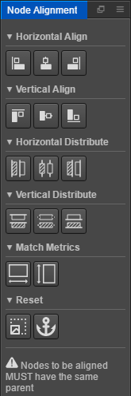

# The missing nodes alignment tool for Cocos Creator

## Installation

```bash
cd ~/.CocosCreator/packages
git clone https://github.com/aztack/cc-alignment.git
```

## Screenshot



### v0.0.1

- Align nodes horizontally/vertically
- Distribute nodes horizontally/vertically
- Match nodes width/height with first selected node
- Reset node scale (to 1) and anchor (to 0.5)
